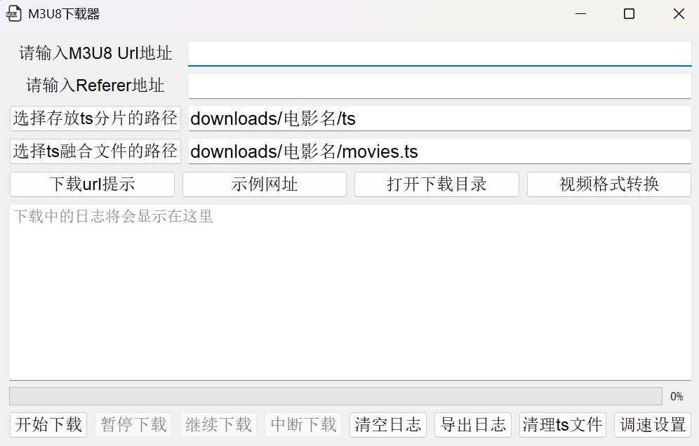

# 🎬 M3U8 Downloader

一个基于 **PyQt5** 的 m3u8 视频下载工具，支持：

* 多线程下载 TS 分片（可调速）
* 视频格式转换线程
* AES-128 解密（自动处理 key / iv）
* 自动合并 TS 文件
* 支持网址列表管理（本地配置）

---

## 📦 项目结构

```
m3u8_downloader/
├─ __init__/
│  ├─ __init__.py
│  ├─ xx1.py
│  ├─ xx2.py
│  ├─ xx3.py
│  └─ xx4.py  (一些之前的测试文件)
├─ ui/
│  ├─ __init__.py
│  └─ main_window.py        # 主界面（UI逻辑）
├─ core/
│  ├─ __init__.py
│  ├─ convert_thread.py    # 转换线程核心逻辑
│  └─ downlod_thread.py    # 下载线程核心逻辑
├─ utils/
│  ├─ __init__.py
│  └─ configs.py           # 配置管理（路径/参数）
├─ resources/
│  ├─ logo.png
│  ├─ supported_m3u8_list.txt
│  └─ download_log.txt
├─ downloads/              # 下载输出目录
├─ main.py                 # 程序入口
```

---

## 🚀 启动方式

1 在项目根目录运行：

```bash
python main.py
```
2 url框输入m3u8的url，Referer框输入视频的播放网址，点击【开始下载】
* 注意：有些网址只需要m3u8 url，有些则二者都需要复制进去

---

## 🧩 功能说明

### 📥 下载功能

* 输入 m3u8 URL
* 自动解析 TS 分片
* 支持 AES-128 解密
* 自动合并为 `.ts` 文件

---

### ⚡ 调速功能

* 可设置最大并发数（默认 8），根据电脑性能进行修改

---


### 🌐 支持网址列表

* 本地文件维护：`resources/supported_m3u8_list.txt`
* 格式：

```
名称 | URL
```

示例：

```
小鸭看看 | https://play.subokk.com/play/hls/rb2kDPdW/index.m3u8
```

* 其他网址请自行探索，不保证所有网址都有用

---

## ⚙️ 配置说明

配置文件：

```
utils/configs.py
```

可配置项包括：

* 默认下载路径
* 最大线程数
* 日志刷新频率
* 资源文件路径

---

## 🛠 依赖环境

```bash
pip install pyqt5 requests m3u8 pycryptodome pyinstaller 

```

---
## 🛠 打包为可执行文件

```bash
python -m PyInstaller --windowed --name m3u8_downloader --icon=resources\logo.png --add-data "resources\logo.png;resources" --add-data "resources\supported_m3u8_list.txt;resources" main.py

```
---

## ❗ 使用说明（重要）

本工具**不是自动抓取工具**，需要自己获取 m3u8 URL：

### 获取方式：

1. 打开视频网站
2. 右键 → 检查（开发者工具）
3. 切换到【Network / 网络】
4. 搜索 `m3u8`
5. 找到正确的播放地址

⚠️ 注意：

* 不是网页地址！
* 是 `.m3u8` 结尾的真实流地址

---

## 🧠 注意事项

* 部分 m3u8 使用复杂加密（本工具不支持）
* 网络波动可能导致 TS 下载失败（可重试）

---


## 📄 License

仅供学习交流使用，请勿用于非法用途。


---

⭐ 如果你觉得有用，可以自己继续扩展功能 😄
